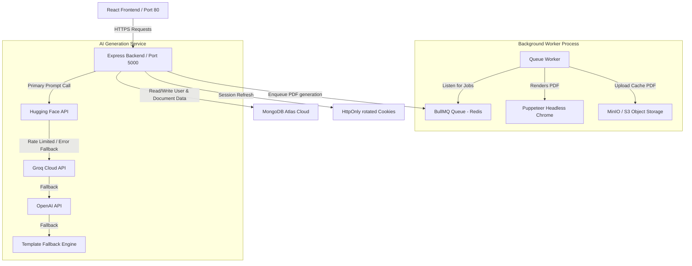

<p align="center">
  
</p>

# RISALATECH — AI-Powered HR Document Generator

RISALATECH is a production-grade SaaS application designed to automatically generate professional HR documents (Motivation Letters and Recommendation Letters) in **English**, **French**, and **Arabic** (with RTL layout support). 

Users are guided through structured forms, eliminating the need to write manual prompts. The backend translates these parameters into optimal instructions for the Large Language Models (LLM), serving character-by-character live streaming, instant HTML previews, and high-performance downloadable PDF files.

---

## 🏛️ System Architecture



---

## ✨ Features

- **Prompt-Free Input UI**: Collects structured form fields and translates them internally into tailored prompts.
- **Multilingual Support**: Supports document creation in English, French, and Arabic (fully optimized RTL view).
- **JWT Auth & Silent Session Rotation**: Dual-token authentication with httpOnly cookie rotation and client-side automatic Axios interceptor retries.
- **Background PDF Synthesizing**: Offloads PDF generation via Puppeteer out of the Express loop using BullMQ background queues.
- **Multi-Provider AI Resiliency**: Circuit breaker cascading pattern ensuring document generations even if primary HuggingFace endpoints are rate-limited or down.
- **SSE Char Streaming**: Renders words character-by-character as they stream live from the AI engine.
- **GDPR Compliance**: Immediate user data export and deletion endpoints.
- **Prompt Injection Sanitizer**: Proactively blocks malicious injection scripts on incoming inputs.
- **Docker-ready**: Fully containerized structure using a optimized Docker Compose V2 layout.

---

## 🛠️ Technology Stack Summary

| Layer | Technology |
|---|---|
| **Frontend** | React (Vite), Zustand, TailwindCSS, Axios, i18next |
| **Backend** | Node.js, Express.js, Mongoose, BullMQ, Pino |
| **Databases** | MongoDB Atlas, Redis (Cache & Queue) |
| **Storage & Infra** | MinIO / AWS S3, Nginx, Docker |
| **AI API Providers** | Hugging Face Inference API, Groq, OpenAI |

---

## 📂 Project Monorepo Structure

```
career-docs-ai/
├── backend/            # Express Server codebase & Dockerfile
├── frontend/           # React Client codebase & Dockerfile
├── docker-compose.yml  # Main orchestration file (Redis, MinIO, Backend, Frontend)
├── .env                # Centralized root configuration (loaded by Docker Compose)
├── .env.example        # Env configuration boilerplate
└── README.md           # This document
```

---

## 🚀 Setup & Launch Instructions

### Method 1: Using Docker Compose (Easiest & Recommended)
Docker Compose orchestrates the full system (Redis, MinIO, Backend, and Frontend Nginx server) and links it directly to your MongoDB Atlas Cloud database.

1. **Configure credentials:**
   Copy `.env.example` to `.env` in the root and fill in your real HuggingFace token and keys:
   ```bash
   cp .env.example .env
   ```
2. **Build and start services:**
   ```bash
   docker compose up -d
   ```
3. **Access the application:**
   * **Frontend Application**: [http://localhost](http://localhost) (Port 80)
   * **Backend REST API**: [http://localhost:5000](http://localhost:5000)
   * **MinIO Console**: [http://localhost:9001](http://localhost:9001)

4. **Shutdown services:**
   ```bash
   docker compose down
   ```

---

### Method 2: Running Locally for Development

#### 1. Setup Database & Redis
Ensure a local MongoDB and Redis instance are running on your machine.

#### 2. Run the Backend
```bash
cd backend
npm install
npx puppeteer browsers install chrome
npm run dev
```

#### 3. Run the Frontend
```bash
cd ../frontend
npm install
npm run dev
```
Open [http://localhost:3000](http://localhost:3000) to view the client app.

---

## 🤝 Contribution Guidelines
1. Fork the project.
2. Create your feature branch (`git checkout -b feature/AmazingFeature`).
3. Commit your changes (`git commit -m 'Add some AmazingFeature'`).
4. Push to the branch (`git push origin feature/AmazingFeature`).
5. Open a Pull Request.

---

## 📄 License
This project is licensed under the MIT License - see the LICENSE file for details.
